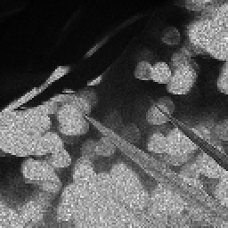
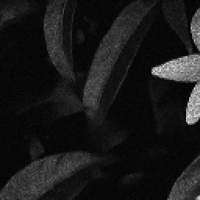
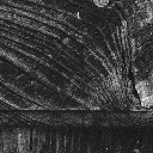
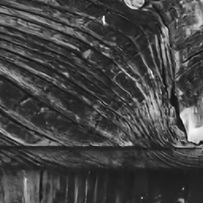
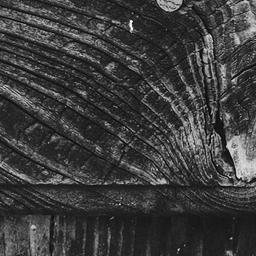

# 🔍 DRISHTI-Net (दृष्टि)

> **One forward pass. Zero edits. Measured, not promised.**
> Deterministic restoration of degraded semiconductor-inspection images — joint speckle denoise + Gaussian deblur + 2× super-resolution, selected through controlled ablation on real KLA pairs.


**KLA i4C Hackathon · Problem Statement PS01** — AI-Based Restoration of Degraded Images for Semiconductor Inspection ·
**D**egradation-aware **R**estoration via **I**mplicit **S**upervision for **H**igh-fidelity **T**echnology **I**nspection

---

## 🖼️ Panels — the shipped checkpoint's own outputs (never-trained holdout frames)

Selected by **measured rule**, not by eye: **A** = typical (nearest-median PSNR) · **B** = strongest among *textured* frames (Sobel-energy floor ≥ P25 — near-blank frames earn trivially high PSNR and are excluded by rule, skipped frames printed by name) · **C** = challenging (P10).

| Case | Degraded input | DRISHTI-Net output | Ground truth |
|------|:---:|:---:|:---:|
| **A — typical** · 003193 |  |  |  |
| **B — strongest textured** · 003107 |  |  |  |
| **C — challenging** · 003136 |  |  |  |

| Case | PSNR ↑ | SSIM ↑ |
|------|-------:|-------:|
| A — typical | 29.07 dB | 0.9029 |
| B — strongest textured | 37.22 dB | 0.9538 |
| C — challenging | 23.87 dB | 0.7097 |

*PNGs are display-normalized renders; every caption number is printed by `scripts/make_panels.py` (receipts: `docs/panels/panels_index.txt`).*

---

## 🚀 What It Does

One model restores a corrupted inspection frame in **a single deterministic forward pass** — no cascade, no generative prior:

| Degradation | Behaviour measured on real data | Design answer |
|---|---|---|
| **Multiplicative speckle** | Degraded pixels span **[−0.28, +2.16]** vs GT [0,1] | Range-safe 2-channel encoding `[x/S, log1p(x/S)]`, fixed scale S — **never clips** |
| **Gaussian haze** | Blur + additive noise (Day-0 census of all 3,200 pairs) | Edge-aware loss terms, gated by isolated ablation arms |
| **2× resolution loss** | 512²→256² or 256²→128² | PixelShuffle ×2 + global bilinear residual, one joint pass |

Deterministic reconstruction objective — *minimizing* the risk of synthesizing unsupported structures (or erasing real ones). Built for metrology, not for pretty pictures.

---

## ⚡ Quickstart (~2 min)

```bash
git clone https://github.com/Adityag476/DRISHTI-Net.git
cd DRISHTI-Net
pip install -r requirements.txt
```

Verify in 30 s with the bundled demo + smoke weights (CPU is enough):

```bash
python evaluate.py --input_dir demo/lq --output_dir demo/restored --weights tests/smoke/drishti_net_smoke.pt
# expected: 4 restored 256x256 uint16 images in demo/restored + a latency line
```

### Inference — the exact zero-edit command the benchmark runs

```bash
python evaluate.py --input_dir /path/to/degraded --output_dir /path/to/restored
# --weights weights/drishti_net.pt   --tta (8x self-ensemble, default OFF)
```

- **Zero manual edits:** auto CUDA→CPU, FP16 with FP32 fallback, CPU-only fallback graceful.
- Reads `.png/.tif/.bmp/.jpg` **and `.npy`** (the KLA train format); `.npy` out keeps name + dtype.
- Outputs mirror **GT dtype and range exactly** (uint8→uint8, uint16→uint16, float→float/.tif).

---

## 📊 Results — every number measured on our own harness, 160-frame held-out split

| Configuration | PSNR ↑ dB | SSIM ↑ | Loss recipe | Verdict |
|---|--:|--:|---|---|
| **Champion: M3e (FabLoss V2), step 21,000** | **29.33** | **0.7913** | Charb + 0.2·Sobel + 0.1·FFT-mag | **SHIPPED — beat gate on both** |
| Gate-setter: M0r-v5, step 19,000 | 29.32 | 0.7911 | Charbonnier | baseline it beat |
| Ablation M3a / M3d (+ control) | 13.20 / 13.48 | 0.3257 / 0.5606 | Charb + 0.5·MS-SSIM (±Sobel) | collapse — excised |
| Ablation M3b | 29.31 | 0.7907 | Charb + 0.2·Sobel | safe ≠ useful |
| Ablation M3c | 29.29 | 0.7924 | Charb + 0.1·FFT-mag | SSIM-lean → V2 seed |

> **Honesty note:** margins under ~0.05 dB are within observed run-to-run variance and are not claimed as significant. Exact checkpoint values (13-decimal receipts) live in `reports/` + `MASTER_SPEC.md`.
> SSIM = our Gaussian-window implementation (consistent internal comparator). Extended suite — edge-region PSNR, flat-region residual σ (lower = better) 0.0232, worst-10%-patch SSIM 0.7354, LPIPS **local-only diagnostic** — in `reports/M3e_30k.md` and `reports/M0r_v5.md` (dual `scripts/report.py` runs).

### 🌐 OOD proxy — shown openly

On a **synthetic degradation family no candidate ever trained on** (all checkpoints real-pairs-only; LANCZOS4 corner, seed 777, paired inputs): champion **25.46 dB / 0.604** · baseline 25.56 / 0.611 · FiLM variant 25.56 / 0.611 — all within 0.11 dB. **On this proxy, neither enhanced model improved over the real-only baseline** — evidence, not a prediction of the KLA test set. M0r-v5 (proxy-best) retained as fallback. (`reports/lodo_kernel3.md`, deterministic across reruns.)

### ⏱️ Latency — synchronized trace, device labeled honestly

| Metric | Value | Protocol |
|---|--:|---|
| Median | **16.53 ms/img** | 800 consecutive per-image-CUDA-sync'd frames |
| p95 | 19.19 ms | SM-clock sampled trace (`scripts/latency_trace.py`) |
| Streaming | 17.4 ms/img | full-folder pass, 3,200 images |

Local **RTX 4060 Laptop GPU** benchmark — the GPU-ramp hypothesis was tested and *falsified* by the trace. No H100 projection; official timing is KLA's H100 harness. ~3.5 M-param model ≈ 14 MB fp32; a 30k-iter training run ≈ 1.5 h on this laptop.

---

## 🧠 Architecture

```
Input 128²/256²            NAF-style U-Net                 Output 256²/512²
float32, native range  →   enc [2,2,4] → mid 4 → dec [2,2,2]  →  GT dtype & range
[x/S, log1p(x/S)]          SimpleGate + SCA + LayerNorm          exact inversion
2 ch · no clipping         no BatchNorm · PixelShuffle ×2        (mirrors input)
```

- **NAF-style blocks** (SimpleGate, SCA, LayerNorm — SCA placement adapted, deliberate variant) · **3,468,585 params** (exact count printed from the shipped checkpoint).
- **FiLM degradation conditioning** (z-NORM + tanh-bounded gains): revised implementation remained stable under 10k-step telemetry, eliminating the previously observed runaway behavior — but it did not beat the gate in budget, so the **shipped checkpoint keeps conditioning dormant** (claims gated by ablation, not by hope).
- **FabLoss V2 (shipped):** Charbonnier + 0.2·Sobel + 0.1·FFT magnitude consistency (L1, orthonormal). **MS-SSIM (λ=0.5) rejected by measurement**: real-only arms collapsed to 13.20/13.48 dB with erratic gradient spikes to ×232/×736 (vs ≤0.2 in every stable arm) — excised by evidence, kept in-repo for the record.
- Deliberately absent: diffusion / GAN (hallucination risk + fails the latency benchmark), MoE & hard routing (instability + branching latency), Mamba/SSM (toolchain risk on a clean benchmark machine), BatchNorm.

---

## 🏗️ Repo Map

```
evaluate.py             zero-edit CLI inference (benchmark-critical) — the file judges run
train.py                ladder-driven training: EMA, bf16 AMP, cosine LR, two-batch-type loader
weights/drishti_net.pt  THE shipped champion — exactly one model file
models/  losses/  data/  utils/      net + FabLoss + degradation engine + metric suite
scripts/report.py       holdout metrics + timing harness (both champions)
scripts/latency_trace.py  800-frame synchronized latency trace with SM-clock sampling
scripts/lodo_eval.py    unseen-synthetic-family OOD generalization probe (eval-only)
scripts/make_panels.py  rule-based panel selection (texture floor; skipped frames printed)
scripts/day0_audit.py   dataset fingerprinting (dtype, speckle family, MTF blur, engine fit)
reports/                M3e_30k · M0r_v5 · lodo_kernel3 (md+json) · latency_trace.csv
docs/panels/            A/B/C renders + panels_index.txt receipts
docs/                   KLA 9-slide deck (final composed version) + audit report
tests/smoke/            smoke weights (dev-only placeholder, power-on self-test)
demo/                   4 sample pairs + restored outputs — no-dataset install check
MASTER_SPEC.md          the full build/adjudication log: gates, falsifications, errata, receipts
```

---

## 🔬 Reproduce Any Number

```bash
python scripts/report.py --weights weights/drishti_net.pt --gt DATA/gt --lq DATA/degraded   # full metric suite
python scripts/latency_trace.py --weights weights/drishti_net.pt                            # 16.53/19.19 receipt
python scripts/lodo_eval.py --weights runs/M0r_v5/best.pt,runs/M3e_30k/best.pt --real_gt DATA/gt   # OOD proxy
python scripts/make_panels.py --lq DATA/degraded --pred outputs/restored_train --gt DATA/gt --out docs/panels
```

Training arithmetic (Charbonnier + Sobel + FFT-mag weights, gate rule, ladder levels) is unit-tested in `scripts/test_losses.py` and locked in `MASTER_SPEC.md`.

## 🎬 Demo

[▶ Watch the 62-second run video](https://youtu.be/XoaiKg5po4c) — zero-edit `evaluate.py` live restore + the measured reports

## 📄 Deck & Paper Trail

- `docs/DrishtiNet_KLA_PS01_final.pptx` — the 9-slide submission deck (this repo rendered it).
- `docs/audit_report/` + `docs/reviewer_evidence_v5.md` — Day-0 census + multi-reviewer adjudication packs.
- `MASTER_SPEC.md` — every gate, falsified hypothesis, erratum, and declined-with-reason demand, logged.

**License:** MIT · **Status:** SHIPPED — champion = FabLoss V2, gate-verified on the held-out 160 pairs.
